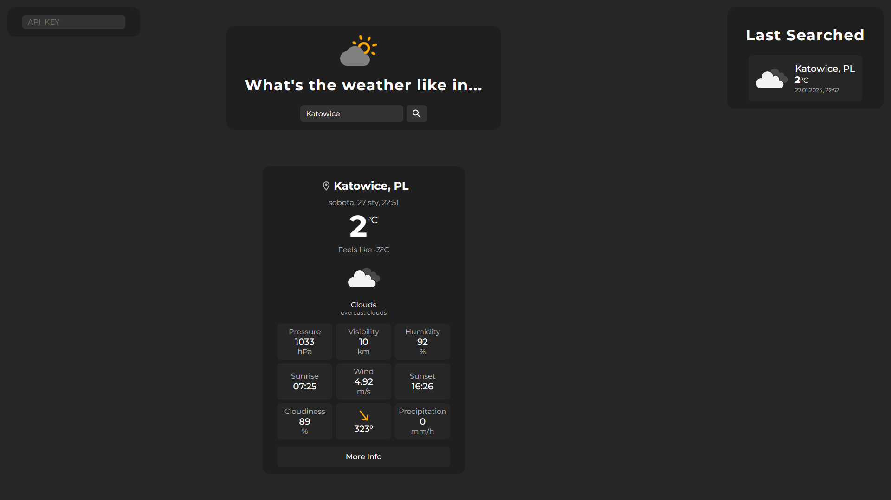
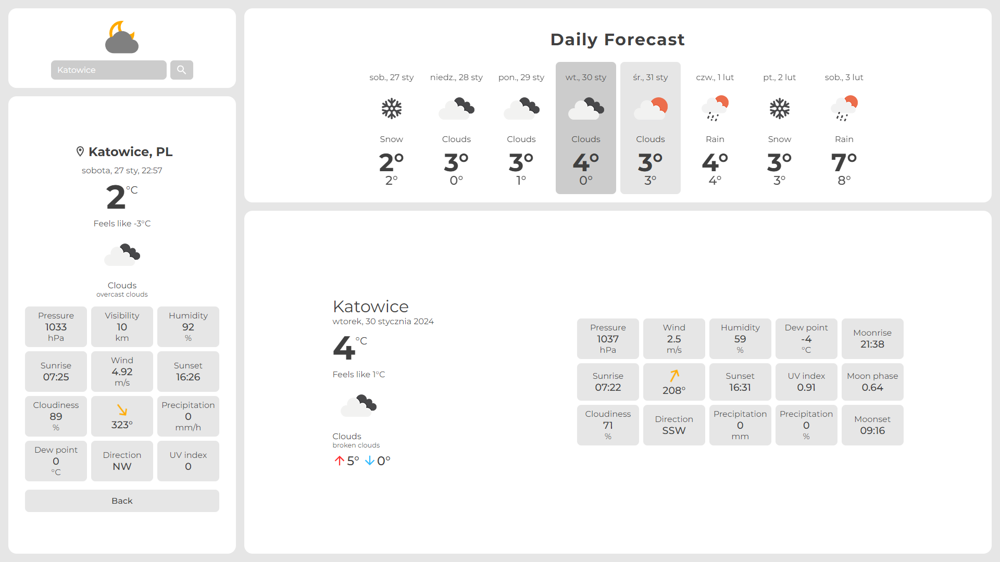

# Weather App

Weather App made with HTML, CSS, JS and OpenWeatherAPI





## Demo

Live demo: https://thugraven.github.io/WeatherApp/

## Setup

To run this project you need to use Local Server

Use the input in top left corner or create a 
```settings.js``` file:
```
export const API_KEY = "...";
```

## Issues

App uses older versions of OpenWeatherAPI that used built-in geocoder and One Call API 2.0, therefore newer api keys will not work
